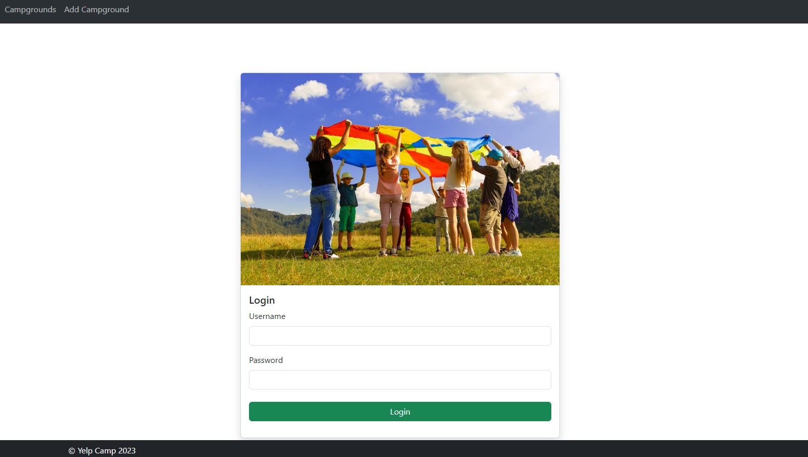
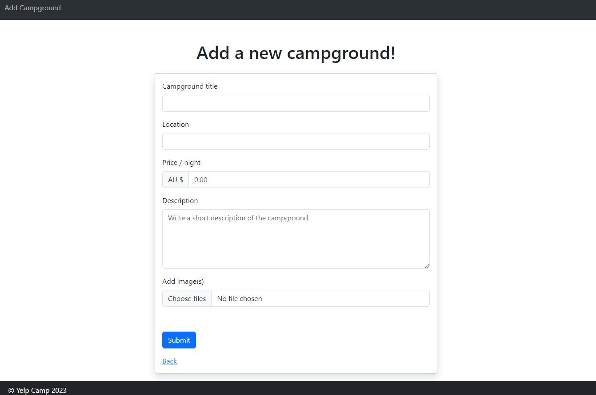
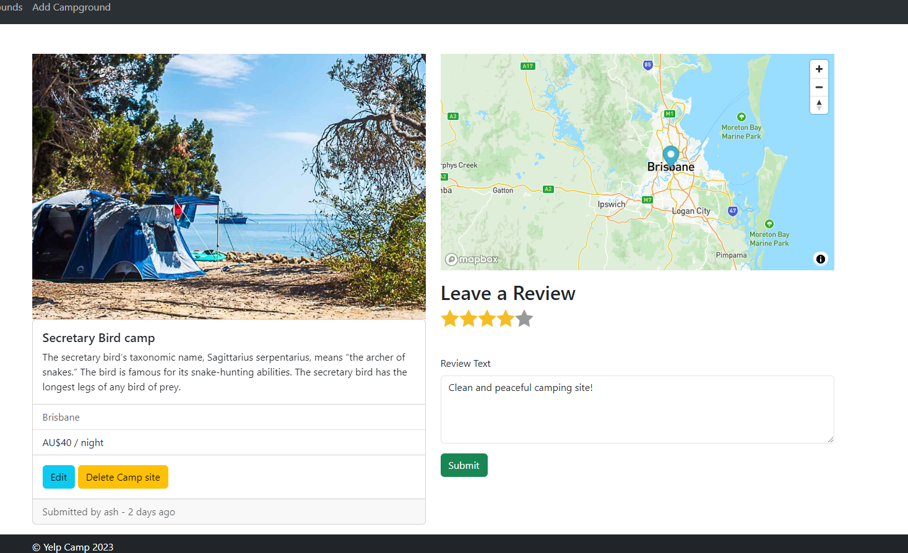

# YelpCamp - Campground Review Platform

YelpCamp is a web application that allows users to explore and review camping grounds
across the globe. Users are able to register, log in, submit campground reviews and
even add images to make their submissions more appealing.

<a href='https://yelpcamp-zil.onrender.com/'>Live Version</a>

## Features

- User Authentication: Securely register and log in to your account, ensuring
  personalized experience.
- Campground Reviews: You can share experiences by submittings reviews of campgrounds
  that includes comments and ratings.
- Map Integration: Map is integrated via Mapbox API, that displays the locations of
  each campground, making it easier for users to know the location of the campground.
- Image Uploads: Image uploads is powered by the Cloudinary API, ensuring seamless
  and efficient image storage.
- Database Connectivity: The application uses Node.js, Express.js and MongoDB,
  storing user information, campground details and reviews.
- Built and Deployed: YelpCamp is hosted on <a href='https://render.com/'>Render</a>.

## Technologies Used

- JavaScript
- CSS
- Node.js
- Express.js
- MongoDB Atlas
- Mapbox API
- Cloudinary API
- Render

## Screenshots

#### Welcome Page

#### Login Page

#### Submit a new campground site

#### Campground site page

